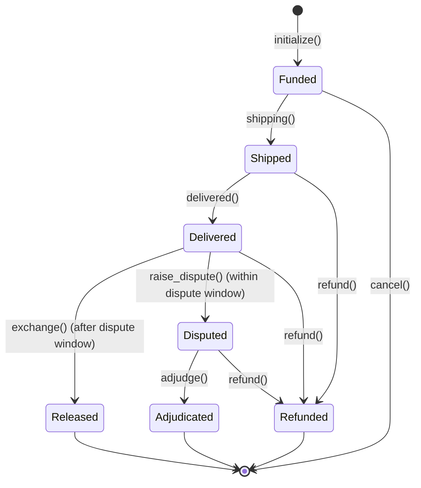

# Lambda Escrow Architecture

This document describes the high-level architecture and lifecycle of the Lambda Escrow smart contract.

## Escrow Lifecycle

## Fee Distribution

The escrow handles three types of fees:
1. **Logistics Fee**: Paid upfront by the buyer at `initialize()` and transferred immediately to the platform vault.
2. **Platform Fee**: 5% of the total amount, calculated at `initialize()` and transferred to the platform vault at `shipping()`.
3. **Seller Proceeds**: The remaining amount is split into milestones:
    - 50% of `remaining_after_fees` is released at `shipping()`.
    - The other 50% is released at `exchange()` or `adjudge()`.

## Roles

- **Buyer**: Deposits funds, receives the item, and can raise disputes.
- **Seller**: Receives funds upon reaching milestones.
- **Judge (Flamingo Oracle)**: Authorizes shipping, delivery, and resolves disputes. The Judge is the sole authority for logistical state transitions.
- **Admin**: Configures global program parameters (e.g., volume thresholds, dispute windows).

## Security Features

- **Circuit Breaker**: Automatically pauses the program if volume thresholds are exceeded.
- **Token Account Validation**: Ensures token accounts are not frozen and use the correct mint.
- **Configurable Dispute Window**: Allows the platform to adjust the time buyers have to raise disputes.
- **Dispute Resolution Deadline**: Ensures disputes are handled in a timely manner.
- **Safe Math**: All calculations use checked arithmetic to prevent overflows and rounding losses.
