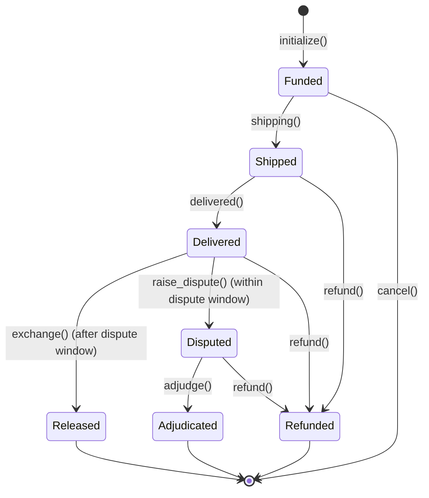

# Flamingo Live Escrow — Architecture

This document describes the high-level architecture and lifecycle of the Flamingo Live Escrow smart contract.

## Escrow Lifecycle

## Fee Distribution

The escrow handles three types of fees:
1. **Logistics Fee**: Paid upfront by the buyer at `initialize()` and transferred immediately to the platform vault.
2. **Platform Fee**: 5% of the total amount, calculated at `initialize()` and transferred to the platform vault at `shipping()`.
3. **Seller Proceeds**: The remaining amount is split into milestones:
    - 50% of `remaining_after_fees` is released at `shipping()`.
    - The other 50% is released at `exchange()` or `adjudge()`.

## Roles

- **Buyer**: Deposits funds, receives the item, and can raise disputes.
- **Seller**: Receives funds upon reaching milestones.
- **Judge (Flamingo Oracle)**: Authorizes shipping, delivery, and resolves disputes. The Judge is the sole authority for logistical state transitions.
- **Admin**: Configures global program parameters (e.g., volume thresholds, dispute windows) and can rotate admin authority via `update_admin`.

## Security Features

- **Circuit Breaker**: Rejects new deposits if the rolling volume threshold is exceeded; admin manually pauses/unpauses via `update_config`.
- **Token Account Validation**: Ensures token accounts are not frozen and use the correct mint — checked before any transfers in `initialize`.
- **Consistent Volume Tracking**: `deposited_amount` stored per escrow ensures circuit-breaker decrements on cancel/refund are consistent with what was originally added, regardless of partial milestone releases.
- **Two Distinct Deadlines**: `dispute_window` is the buyer's window to call `raise_dispute` after delivery (error: `DisputeWindowExpired`). `dispute_resolution_deadline` is the judge's window to call `adjudge` after a dispute is raised (error: `DisputeResolutionDeadlineExpired`). Both are configurable via `update_config`.
- **Safe Math**: All calculations use checked arithmetic to prevent overflows and rounding losses.
